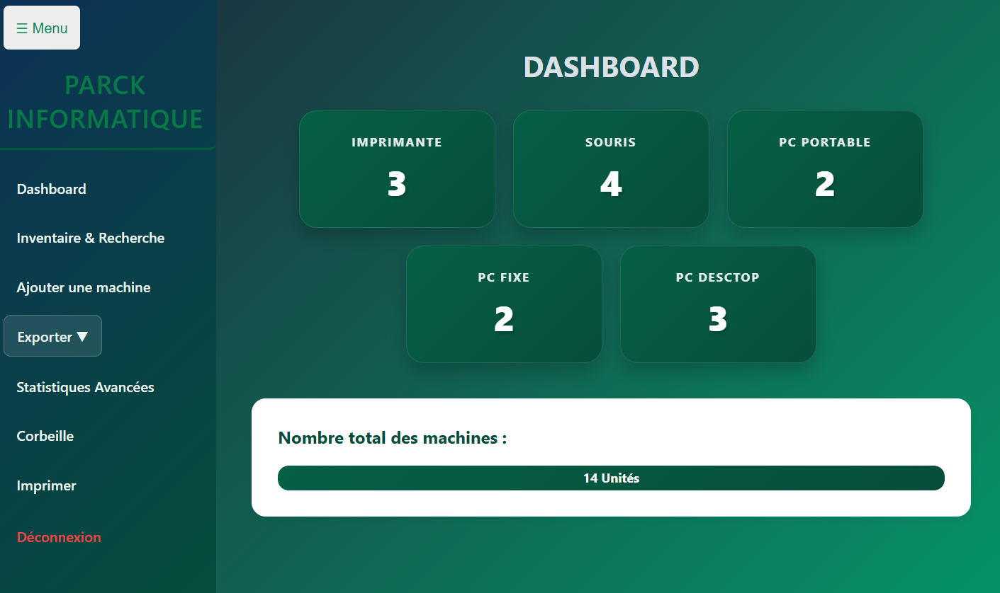
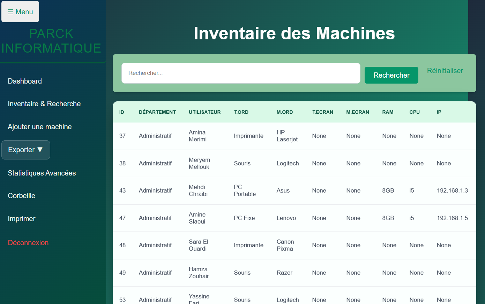
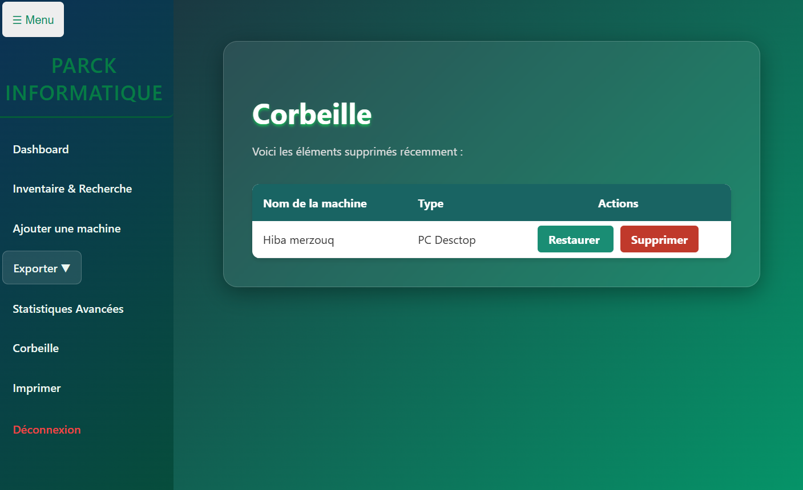

## 🖼️ Aperçu de l'application

### 🔐 Page de connexion

La page de connexion permet à l'utilisateur de s'authentifier avant d'accéder à l'application.

---

### 📊 Tableau de bord

Le tableau de bord présente une vue globale du parc informatique et permet d'accéder rapidement aux différentes fonctionnalités.

---

### 📋 Liste des équipements

Cette interface permet de consulter et de rechercher les équipements informatiques enregistrés dans le système.

---

### 📈 Statistiques

Cette page permet de visualiser les statistiques liées aux équipements du parc informatique.

---

### ♻️ Corbeille

La corbeille permet de consulter les équipements supprimés et de les restaurer ou de les supprimer définitivement.

